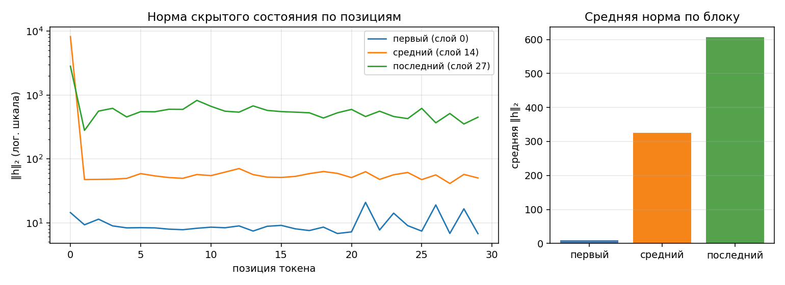

# ДЗ 2. Анатомия Qwen/Qwen3-0.6B

Губин Виталий Андреевич, ИУ6-74Б. Продолжение ДЗ 1 на том же компьютере.

Дата эксперимента: 2026-09-12T15:43:17+03:00. Числа получены реальными запусками; вход для проверки памяти состоит из случайных токенов.

## 1. Конфигурация модели

| Характеристика | Значение |
|---|---|
| Блоков (`num_hidden_layers`) | 28 |
| Ширина скрытого состояния (`hidden_size`) | 1024 |
| Ширина MLP (`intermediate_size`) | 3072 |
| Голов запроса (`num_attention_heads`) | 16 |
| Голов ключа и значения (`num_key_value_heads`) | 8 |
| Размер головы (`head_dim`) | 128 |
| Размер словаря (`vocab_size`) | 151936 |
| Общие входные и выходные веса (`tie_word_embeddings`) | True |

Версия весов: `c1899de289a04d12100db370d81485cdf75e47ca`. Имя модели читается из `params.yaml`.

## 2. Условия замера

| Условие | Значение |
|---|---|
| платформа | macOS-15.7.9-arm64-arm-64bit |
| Компьютер | Apple M3 Pro, 12 ядер CPU, 18 ядер GPU, 36 ГиБ общей памяти |
| устройство | mps |
| dtype базовых весов | bfloat16 |
| seq_len | 256 |
| batch_size | 1 |
| прогонов каждого режима | 3; каждый в новом процессе |
| Итоговая память | Максимум пиков отдельных прогонов |
| Метрика памяти | torch.mps.driver_allocated_memory |
| Дополнительная метрика RSS | ru_maxrss |
| Интервал опроса MPS | 0.002 с, плюс границы этапов |
| Начальное состояние случайности, seed | 42 |
| Кэш ключей и значений, use_cache | False |
| Сохранение активаций с пересчётом, gradient checkpointing | Выключено |
| Оптимизатор | AdamW, lr=1e-5, foreach=False; один шаг |
| Режим офлайн, HF_HUB_OFFLINE | 1 |
| Python | 3.12.14 |
| torch | 2.8.0 |
| transformers | 4.57.6 |
| peft | 0.17.1 |

Все величины памяти даны в **МиБ = 2²⁰ байт**. В шаблоне курса эти же единицы подписаны «МБ».
Прямые зависимости закреплены точными версиями, все остальные — в `uv.lock`.
Время охватывает загрузку модели и проверяемый шаг, но не запуск Python и импорт библиотек; это сопутствующий показатель, а не бенчмарк скорости генерации из ДЗ 1.

## 3. Параметры по типам модулей

| Группа | Модулей | Форма веса | Уникальных параметров | Доля |
|---|--:|---|--:|--:|
| `embed` | 1 | 151936×1024 | 155 582 464 | 26.1023% |
| `q_proj` | 28 | 2048×1024 | 58 720 256 | 9.8516% |
| `k_proj` | 28 | 1024×1024 | 29 360 128 | 4.9258% |
| `v_proj` | 28 | 1024×1024 | 29 360 128 | 4.9258% |
| `o_proj` | 28 | 1024×2048 | 58 720 256 | 9.8516% |
| `gate_proj` | 28 | 3072×1024 | 88 080 384 | 14.7774% |
| `up_proj` | 28 | 3072×1024 | 88 080 384 | 14.7774% |
| `down_proj` | 28 | 1024×3072 | 88 080 384 | 14.7774% |
| `norm` | 113 | 128, 1024 | 65 536 | 0.0110% |
| `lm_head` | 1 | 151936×1024 | 0 | 0.0000% |
| **Итого** | | | **596 049 920** | **100%** |

Прямая проверка `sum(p.numel() for p in model.parameters())` даёт **596 049 920**.
[Полная таблица каждого именованного тензора](parameters.md) и исходные значения в [report.json](report.json).

### Почему таблица устроена именно так

**Общие веса.** `lm_head.weight` ссылается на тот же объект, что `embed_tokens.weight`: 155 582 464 чисел. Выходной модуль существует, но новых параметров не добавляет. Обходим `named_parameters(remove_duplicate=False)`, сохраняем обе строки и учитываем каждый `id` один раз.

**Группированное внимание (GQA).** На 16 голов запроса приходится 8 голов ключа и значения. Поэтому K и V имеют 29 360 128 параметров, Q — 58 720 256. У Qwen3 размер головы задан отдельно: 16 × 128 = 2048, хотя hidden_size = 1024.

**Полносвязная часть блока (MLP).** Три матрицы по 3072 × 1024 дают 9 437 184 параметра на блок; четыре проекции внимания вместе дают 6 291 456. Отношение — 1,5. Во всей модели MLP занимает 44,33%, проекции внимания — 29,55% (округление до сотых).

**Нормализации.** 57 векторов длины 1024 и 56 векторов длины 128: 57 × 1024 + 56 × 128 = 65 536 параметров, 113 модулей. У позиционного кодирования RoPE обучаемых весов нет.

## 4. Нормы активаций и удаление обработчиков

Вопрос: «Объясни, что такое MLOps, в трёх предложениях.». После шаблона диалога — 30 токенов. После блоков 0, 14 и 27 для каждой позиции считается евклидова норма вектора из 1024 координат. Вычисление нормы идёт в float32 после отделения тензора от графа.



| Блок | Индекс | Средняя норма | Максимум | Позиция максимума |
|---|--:|--:|--:|--:|
| первый | 0 | 9.674 | 20.844 | 21 |
| средний | 14 | 325.498 | 8189.664 | 0 |
| последний | 27 | 606.968 | 2815.101 | 0 |

Средние нормы на этом вопросе растут с глубиной. Остаточные связи добавляют выход блока к его входу, но не гарантируют монотонный рост каждой нормы: максимум среднего блока здесь больше максимума последнего. Сильный выброс на нулевой позиции согласуется с обсуждением крупных активаций в лекции. Одних норм недостаточно, чтобы доказать накопление внимания на этой позиции: сами веса внимания здесь не измерялись.

Повтор в одном процессе дал те же нормы: **True**. Обработчиков до и после: **0 → 0**. Дескрипторы удаляются в `finally`, включая ошибку во время forward. Исходный режим модулей восстанавливается; чужие обработчики сохраняются.

## 5. Арифметика LoRA

LoRA добавляет к линейному слою две обучаемые матрицы: A размера r × вход и B размера выход × r. Итого **r × (вход + выход)** на модуль. Суммируются реальные размеры найденных линейных слоёв; смещения не обучаются.

| Конфигурация | Целевых модулей | Своя формула | PEFT | Доля от базы |
|---|--:|--:|--:|--:|
| r=8, q_proj+v_proj | 56 | 1 146 880 | 1 146 880 | 0.1924% |
| r=16, все линейные | 196 | 10 092 544 | 10 092 544 | 1.6932% |

Для **r=8, q/v**: 28 × 8 × [(1024 + 2048) + (1024 + 1024)] = **1 146 880**.
Для **r=16, всех семи типов проекций**: 28 × 16 × [2 × 3072 + 2 × 2048 + 3 × 4096] = **10 092 544**.

«Все линейные» здесь означает q/k/v/o/gate/up/down внутри блоков, как в конфигурации задания. Выходной `lm_head` с общими весами не включён. Доля считается от базовой модели; PEFT при печати делит на базу вместе с адаптером, поэтому его процент немного меньше.

## 6. Память в трёх режимах

| Режим | Пик, МиБ | Пик RSS, МиБ | К инференсу | Время выбранного прогона, с |
|---|--:|--:|--:|--:|
| инференс | **1512.8** | 434.6 | 1.00× | 1.896 |
| full fine-tune | **7106.6** | 1072.4 | 4.70× | 1.727 |
| LoRA (r=8, q/v) | **3239.8** | 461.7 | 2.14× | 1.243 |

| Режим | Все три пика, МиБ | Идентификаторы отдельных процессов |
|---|---|---|
| inference | 1512.8, 1512.8, 1512.8 | 2427, 2429, 2430 |
| full_ft | 7106.6, 7106.6, 7106.6 | 2431, 2435, 2437 |
| lora | 3239.8, 3239.8, 3239.8 | 2440, 2441, 2445 |

Инференс — один forward под `torch.inference_mode()`. Полное обучение — forward, backward и один шаг AdamW по всем параметрам. LoRA — тот же шаг только по адаптерам r=8 на q/v. Это проверка памяти обучения, а не обучение полезной модели на датасете.

Потери перед обновлением: full FT 13.978020, LoRA 13.978020. Одинаковый seed задаёт тот же вход; нулевая начальная B у LoRA не меняет выход базовой модели.

### Что именно измеряется

На MPS отдельный поток опрашивает `torch.mps.driver_allocated_memory()` каждые 2 мс с дополнительными отсчётами после загрузки, forward, backward и шага оптимизатора. На границах этапов ожидается завершение вычислений устройства. Берётся наибольший отсчёт до очистки. Это **наблюдаемый пик**: очень короткий выброс между отсчётами может быть пропущен, а планировщик не гарантирует ровно 2 мс между вызовами.

Метрика включает буферы Metal, кэш выделений и память MPSGraph. Она не равна сумме живых тензоров и не складывается с RSS: области могут пересекаться. На CUDA код использует `max_memory_allocated`, на CPU — пик RSS. Реальные запуски этой работы выполнены на MPS; другие устройства не проверялись.

### Объяснение расхода памяти

Базовые веса: 596 049 920 × 2 / 2²⁰ = **1136.875 МиБ**. Все измеренные пики выше этого числа.

| Составляющая, по реальным тензорам | Full FT, МиБ | LoRA, МиБ |
|---|--:|--:|
| Параметры | 1136.8750 | 1141.2500 |
| Градиенты до zero_grad | 1136.8750 | 4.3750 |
| Все состояния AdamW после шага | 2273.7512 | 8.7504 |

Для полного обучения параметры и градиенты имеют формат bf16. Два момента AdamW в данном запуске также имеют bf16; дополнительно есть скалярные счётчики шагов. Эти три составляющие вместе занимают 4547.501 МиБ. Остальной расход включает активации, промежуточные результаты, рабочие буферы и кэш. Нельзя весь остаток назвать активациями: он не измерялся отдельно.

PEFT по умолчанию поднял адаптеры до float32: их параметры и градиенты занимают по 4.375 МиБ, два момента — около 8.750 МиБ. База остаётся bf16. Обучаемых весов всего 0,1924%, однако базовая модель и активации для обратного прохода всё равно нужны.

LoRA уменьшила наблюдаемый пик относительно full FT на 3866.8 МиБ, или 54.4%. При этом она дороже инференса на 1727.0 МиБ. Это объясняет, почему доля обучаемых параметров и доля экономии общей памяти не совпадают.

Числа лекции (2222 / 7166 / 3606 МиБ) не являются эталоном для копирования. В нашей работе явно выключен KV-кэш и зафиксированы версии, формат адаптера, настройки AdamW и способ поиска пика. Эти условия и состояние кэшей влияют на расход. Разницу с лекцией мы не приписываем одной причине без отдельного контролируемого сравнения.

## 7. Четыре дефекта исходной заготовки

Первый `make inspect` выполнен до правок кода. Первый `make check` завершился с четырьмя проваленными пунктами: 1, 3, 4 и 6. Исходные [результаты](baseline/report.json) и [журнал проверки](baseline/check.log) сохранены.

### 7.1. Двойной учёт общих весов

В `parameter_rows()` всем строкам назначалось `tied=False`, хотя обход явно включал повторы. Получалось **751 632 384** вместо **596 049 920**, лишние **155 582 464** — ровно вес эмбеддинга. Исправление: множество уже встреченных объектов параметров; повторная строка сохраняется с отметкой и не увеличивает сумму. После исправления разница равна **0**.

### 7.2. Обработчики слоёв не удалялись

`forward_hooks()` регистрировала обработчики и теряла их дескрипторы. Первоначальная проверка обнаружила **3 оставшихся обработчика после одного вызова**. Теперь контекстный менеджер удаляет каждый дескриптор в `finally`: после двух реальных вызовов **0**, нормы совпадают. Отдельный тест проверяет очистку при исключении и сохранение исходного режима модулей.

### 7.3. Конечный снимок вместо пика и общий процесс

`PeakMemory.__exit__()` сначала вызывал сборку мусора и только затем снимал память. `memory_profile()` выполнял все режимы в одном процессе, поэтому максимум RSS накапливался. В первоначальном отчёте full FT и LoRA получили одинаковые **1166,6 МиБ**. Исправление: непрерывный опрос и отсчёты этапов до очистки, новый процесс на каждый прогон. Теперь пики **7106.6 > 3239.8 > 1512.8 МиБ**. Дополнительный тест моделирует память 10 → 90 → 20 байт: сохраняется **90**, а не 20.

### 7.4. На ускорителе измерялся RSS

`device_allocated_bytes()` и `device_metric_source()` всегда вызывали `peak_rss()`, хотя колонка называлась «аллокатор mps». В исходном инференсе вышло **537,3 МиБ**, меньше 1136.875 МиБ весов. Теперь источник выбирается по устройству; на MPS получено **1512.8 МиБ**, а дополнительный RSS того же процесса — 434.6 МиБ. Эти числа описывают разные величины. Код также отказывается выдавать пик меньше фактического размера базовых весов.

## 8. Сводная таблица и воспроизведение

[anatomy-worksheet.xlsx](anatomy-worksheet.xlsx) заполнена значениями этого эксперимента. Формулы исходных контрольных ячеек сохранены. Для LoRA на том же листе добавлен второй расчёт r=16. В строке norm один сводный вектор объединяет 57 × 1024 + 56 × 128 чисел; это не один реальный слой. У lm_head указано 0 собственных матриц при одном модуле с общими весами. Полные реальные формы и количества модулей приведены выше.

```bash
make install
make inspect
make test
make check
```

После первого скачивания моделей можно добавить `HF_HUB_OFFLINE=1`. `make inspect` создаёт новый эксперимент и перезаписывает JSON, график и отчёт. При этом ранее заполненную таблицу нужно обновить по новым значениям. Исходный `tests/check.sh` сохранён без изменений. Журналы окончательных проверок — [check.log](check.log) и [tests.log](tests.log).

## Источники

- Материалы преподавателя: ДЗ 2, слайды 1–7; лекция 2, слайды 7, 11–14.
- [PyTorch 2.8: память драйвера Metal](https://docs.pytorch.org/docs/2.8/generated/torch.mps.driver_allocated_memory.html).
- [PEFT: конфигурация LoRA](https://huggingface.co/docs/peft/v0.17.0/en/package_reference/lora).
