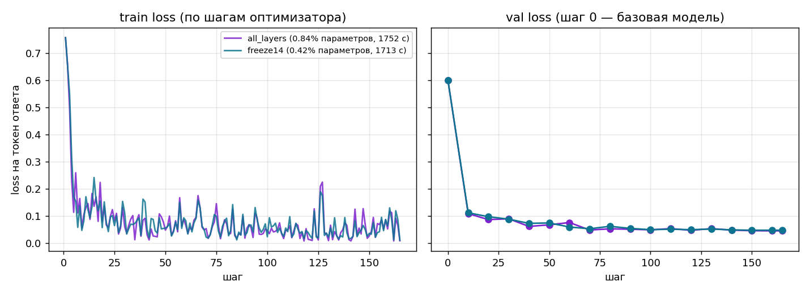

# Результаты двух полных прогонов LoRA

Задача: классификация обращений GitHub на bug, feature_request и question. Отчёт создан из JSON-метрик; значения относятся к нашему датасету, а не к примеру курса.

## Одинаковые условия

База: Qwen/Qwen3-0.6B, ревизия c1899de289a04d12100db370d81485cdf75e47ca. Устройство: mps; базовые веса: bfloat16.
Apple M3 Pro, 36 ГБ общей памяти. LoRA: r=8, alpha=16, dropout=0.05; семь проекций внимания и полносвязных слоёв. Шаг обучения 0.0002; seed=42.

Вход: 1315 train и 281 val из ДЗ4. Одна эпоха, эффективный батч 8. Ограничения max_steps и val_limit выключены. Итоговая тестовая часть ДЗ3 не используется.

## Численное сравнение

| Показатель | Все 28 слоёв | Только слои 14–27 |
|---|---:|---:|
| Обучаемых параметров | 5046272 | 2523136 |
| Всего параметров с адаптером | 601096192 | 598573056 |
| Доля обучаемых | 0.839% | 0.421% |
| Шагов оптимизатора | 165 | 165 |
| Использовано примеров | 1315 | 1315 |
| Входных токенов обработано | 402445 | 402445 |
| Обучаемых токенов обработано | 10959 | 10959 |
| Val loss до обучения | 0.600916 | 0.600916 |
| Val loss после эпохи | 0.045128 | 0.047402 |
| Обучение без оценки, с | 1752.3 | 1713.1 |
| Оценка, с | 1365.1 | 1256.7 |
| Обучение вместе с оценкой, с | 3117.3 | 2969.8 |
| В среднем на шаг без оценки, с | 10.620 | 10.382 |
| Полезных входных токенов/с без оценки | 229.7 | 234.9 |
| Наблюдаемый максимум памяти MPS, МиБ | 5791.7 | 5711.8 |
| Наблюдаемый максимум памяти процесса, МиБ | 8655.8 | 12803.6 |
| Только матрицы адаптера, МиБ | 19.30 | 9.65 |
| Папка с токенизатором, МиБ | 34.46 | 24.81 |

Время измерено после загрузки модели: включает прямые и обратные проходы, обновления параметров и подготовку батчей. Оценка включает исходную точку, замеры каждые 10 шагов и финальный замер. Загрузка и сохранение отдельно в эти интервалы не входят.

Память MPS опрашивается каждые 0,1 с во время обучения и оценки. Это наблюдаемый максимум занятой драйвером памяти, включая кэш; очень короткий всплеск может не попасть в выборку. Память процесса приведена отдельно и не заменяет память MPS. Все размеры памяти и файлов в таблице используют 1 МиБ = 2²⁰ байт.

## Кривые и сохранность данных

Train loss — среднее по обучаемым токенам текущей группы примеров. Val loss — среднее по всем обучаемым токенам всей проверочной выборки. Метки −100 исключают промпт и дополнение из ошибки, но контекст модели доступен полностью.

У каждого варианта 18 точек val: шаг 0, затем 10, 20, …, 160 и 165. Последний шаг использует оставшиеся три примера и нормируется по их фактическому числу обучаемых токенов. Данные не обрезались и не подменялись укороченной выборкой.

## Что изменилось при заморозке

Число обучаемых параметров уменьшилось в 2.0 раза. Отношение времени чистого обучения freeze14/all_layers: 0.978; отношение наблюдаемой памяти: 0.986.
Это два последовательных измерения на одном ноутбуке, а не многократный сравнительный эксперимент. На время влияют температура и фоновые задачи. Повторный расчёт активаций при обратном проходе включён у обоих вариантов, а входным активациям включён requires_grad. Поэтому обратный проход сохраняется и через нижние слои freeze14; число обучаемых матриц уменьшается, но вся эта часть вычислений автоматически не исчезает. Двукратное ускорение не ожидается.

## Сопоставление с прогнозом ДЗ4

В ДЗ4 для трёх эпох было получено 16.590–24.885 ч. На одну эпоху это 5.530–8.295 ч. Фактическое время all_layers: 0.487 ч чистого обучения или 0.866 ч с регулярной оценкой.

Прогноз ДЗ4 опирался на последовательную генерацию и условный множитель 2–3. Дообучение обрабатывает известные токены параллельно, а в этой задаче выходные вероятности нужны только для 8–9 токенов ответа. Поэтому такой прогноз не является точной моделью времени данного цикла. Данные измерения заменяют приблизительную оценку.

## Границы вывода

Снижение val loss показывает уменьшение ошибки предсказания отложенных ответов, в том числе освоение формата JSON. Оно не равно измерению точности классификации. Пять фиксированных запросов в compare.md демонстрируют работу адаптера, но недостаточны для статистически обоснованного сравнения качества.

Проверка повторяемости относится к закреплённым библиотекам, устройству и коротким прогонам с одинаковым seed. Побитовое совпадение между разным оборудованием не обещается.
